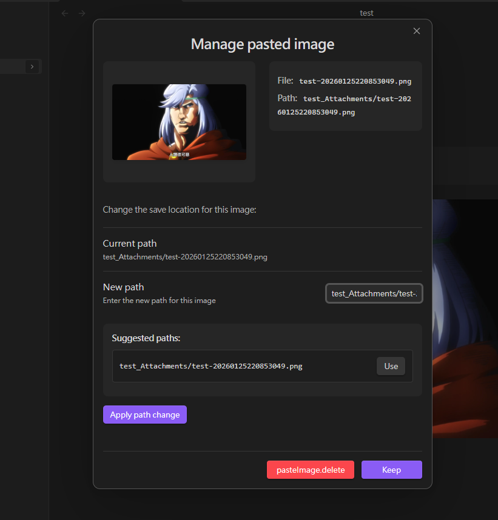
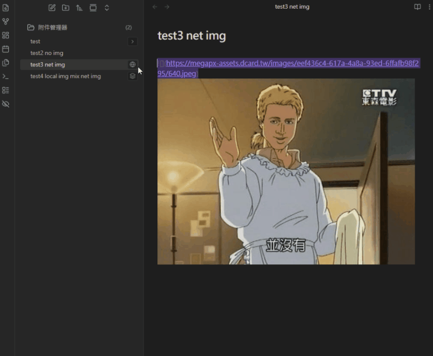
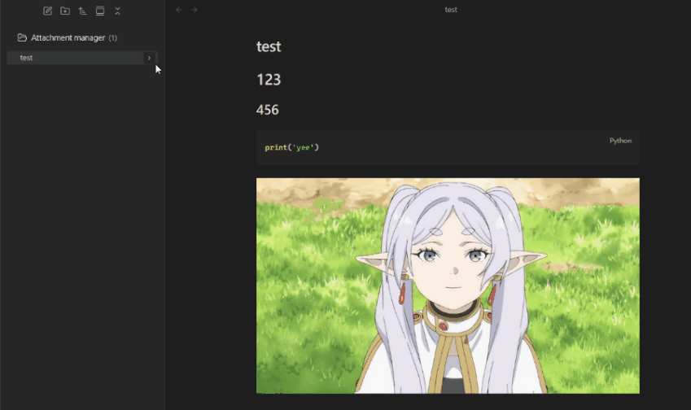
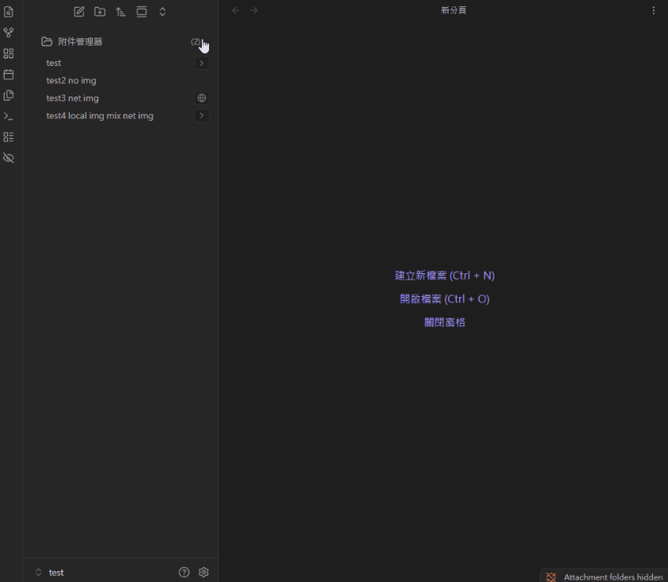
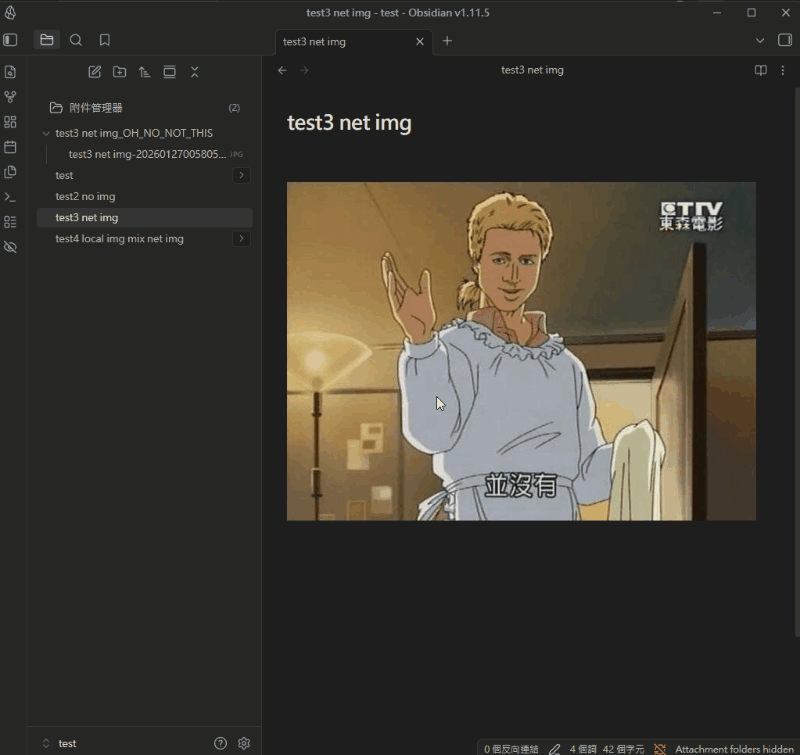

# Attachmenter (Obsidian plugin)

I built Attachmenter as a “per-note first” attachment workflow for Obsidian: it creates an attachment folder per note, manages pasted images, downloads remote images (including Canvas), shows attachments inline in File Explorer, and includes tools for path check/repair and cleanup.

> The UI supports multiple languages: English / 繁體中文 / 简体中文 / 日本語 (configurable in settings).

## Why I built this

I wanted a single plugin that keeps attachments predictable and easy to maintain:

- I prefer **one attachment folder per note**, next to the note, so moving/archiving a note stays simple.
- I wanted **remote images to become local files** with minimal friction.
- I needed **maintenance tools** (scan/repair/cleanup) so an existing vault can be brought into a consistent structure.

---

## Feature overview

- **Per-note attachment folder**
  - Predictable folder location: `<note-folder>/<note-name><folder-suffix>`
  - Example: `Notes/ProjectA.md` → `Notes/ProjectA_Attachments/`
- **Paste image management**
  - Detects Obsidian-generated files named like `Pasted image ...`
  - Automatically moves them into the note’s attachment folder and updates links
  - A modal lets you **Keep / Delete / Change location**
- **Remote image download**
  - Supports Markdown ``
  - Supports Canvas (downloads remote `link` nodes and converts them into `file` nodes)
  - Replaces links with local files and preserves alt text when possible
- **File Explorer attachment tree**
  - Adds an expand button on the right side of each file row in File Explorer
  - Quick actions: preview / rename / delete, plus “this file still has remote images” hints
- **Attachment Manager view**
  - Centralized view of all attachments, grouped by folder
  - Preview / rename / delete, and jump back to the related note
- **Path Check & Repair**
  - Scans `.md` and `.canvas` to validate attachment folders and image links
  - Supports both **Preview changes (dry-run)** and **Execute fixes**
- **Cleanup empty attachment folders**
  - Finds folders that match the configured suffix and are empty, then lets you delete them (to system trash)
- **Show/Hide attachment folders**
  - Ribbon button + command palette command + optional status bar indicator
  - Optional AERO semi-transparent styling

---

## Installation

1. Download `main.js`, `manifest.json`, `styles.css` from [Releases](https://github.com/natlee/obsidian-attachmenter/releases)
2. Put them into your vault at `.obsidian/plugins/obsidian-attachmenter/`
3. Restart Obsidian → Settings → Community plugins → enable `Attachmenter`

---

## Quick start (usage)

### 1) Per-note attachment folder rules

This is how Attachmenter computes the attachment folder path in the current version:

- **Folder path**: `<note-dir>/<sanitized-notename><sanitized-suffix>`
  - `note-dir`: the note’s parent folder
  - `notename`: note filename without `.md`
  - `suffix`: “Folder suffix” in settings
- **Cross-platform sanitization**
  - `#` is replaced with a space
  - Windows-forbidden characters (`< > : " / \ | ? *`) are replaced with spaces
  - Consecutive spaces are collapsed, and leading/trailing spaces/dots are trimmed

### 2) Paste image modal (keep / delete / change path)

When you paste an image in Markdown or Canvas, Attachmenter will:

- Move the `Pasted image ...` file into the active note’s attachment folder
- Update the link in the note / Canvas
- Show a management modal where you can choose:
  - **Keep**: keep the image
  - **Delete**: delete the image file and remove its reference from the note/Canvas
  - **Change location**: manually edit the target path (free-form input)



### 3) Download remote images (Markdown / Canvas)

In the current version, you can trigger this from:

- **Command Palette**
  - `Download remote images in active file` (display text depends on UI language)
  - Runs against the currently active file; supports `.md` and `.canvas`
- **File Explorer context menu**
  - Right-click a `.md` file → `Download remote images`
  - Note: this entry only applies to `.md` (use the command palette for Canvas)



### 4) File Explorer attachment tree (remote hints + quick actions)

When enabled, each Markdown file row in File Explorer gets a small button:

- **Local attachments exist**: you can expand to see the attachment list
- **Remote images exist**: shown with a “globe/layers” hint; expand to download one-by-one or Download All

What you can do after expanding in the current implementation:

- **Local attachments**
  - Preview / Rename (updates references in `.md`/`.canvas`) / Delete (to system trash)
  - Open the folder in your system file explorer
  - Delete the whole attachment folder (to system trash)
- **Remote images**
  - Preview remote images
  - Download a single image or Download All (updates links in the note)



### 5) Attachment Manager view

This view lists all attachments across the vault (folders matching the configured suffix) and groups items by folder.

Entry point in the current version:

- A dedicated **Attachment Manager** button appears at the top of File Explorer (can be disabled in settings)
  - Clicking it opens the `Attachment Manager` view

In this view you can:

- Preview / Rename / Delete attachments
- Open the related note (when it can be inferred from the folder name)



---

## Settings (based on current code)

The table below lists the settings currently present in the UI (defaults come from `DEFAULT_SETTINGS`):

| Setting | Description | Default |
|---|---|---|
| **Language** | UI language | `en` |
| **Folder suffix** | Suffix for per-note attachment folders | `_Attachments` |
| **Attachment name format** | Filename template (supports `{notename}`, `{date}`) | `{notename}-{date}` |
| **Date format** | Moment.js format for `{date}` | `YYYYMMDDHHmmssSSS` |
| **Auto rename attachment folder** | Rename the attachment folder when the note is renamed | On |
| **Rename confirmation behavior** | Rename confirmation strategy | `ask` |
| **Prompt to rename images** | Prompt to rename images when moving them during Path Check | On |
| **Show ribbon icon** | Show the show/hide toggle in the left ribbon | On |
| **Show status bar indicator** | Show “Attachment folders hidden” in the status bar | On |
| **Show attachment manager button** | Show the Attachment Manager button in File Explorer | On |
| **Hide attachment folders** | Hide attachment folders in File Explorer | Off |
| **AERO folder style** | Semi-transparent styling for attachment folders | On |
| **Show file attachment tree** | Inline attachment tree in File Explorer | On |
| **Show remote hint** | Show remote-image hint + download entry in the tree | On |
| **Highlight expanded file title** | Highlight the file row when popover is expanded | Off |
| **Border accent color** | Highlight border color (empty = theme accent) | `""` |

---

## Tool: Path Check & Repair

Entry point:

- Settings → Tools & Maintenance → **Check paths**

It scans `.md` and `.canvas` files and shows:

- File count / image link count / resolved vs unresolved links
- Expected vs actual attachment folders (exists/missing/name mismatch)
- “Invalid character” hints (e.g. `#` or Windows forbidden characters)

Repair modes:

- **Preview Changes**: generates a change plan without writing anything (dry-run)
- **Execute Changes**: creates/renames folders, moves images, and updates links



---

## Tool: Cleanup empty attachment folders

Entry point:

- Settings → Tools & Maintenance → **Cleanup**

Finds folders whose names end with the configured suffix and are empty, and lets you delete them (to system trash).

<!-- TODO: Add a screenshot: Cleanup results list + Delete All -->

---

## Commands & entry points (reference)

| Type | Entry | Description |
|---|---|---|
| Command palette | `download-remote-images-active` | Download remote images in the current active file (`.md`/`.canvas`) |
| Command palette | `toggle-folder-visibility` | Show/hide attachment folders (syncs with the ribbon toggle) |
| File Explorer context menu | `Download remote images` | Download remote images for the selected `.md` file |

---

## Technical details

- **Remote image download**
  - Determines extension from HTTP `content-type`; if missing, falls back to URL suffix guessing
  - Primary support: `png`, `jpg/jpeg`, `gif`, `webp`, `svg`, `bmp`, `apng`, `avif`, `ico`, `tif`
- **Link formats**
  - Markdown images: ``
  - Wiki images (used by Path Check/repair): `![[image.png]]`, `![[image.png|alt]]`
- **Filename/folder sanitization (cross-platform)**
  - Replaces invalid characters with spaces and collapses whitespace
  - Special case: `#` → space
- **Obsidian settings impact (while enabled)**
  - The plugin backs up and may adjust the vault `newLinkFormat`; if it’s not `relative` or `shortest`, it temporarily sets it to `relative`
  - Restores the original value on unload

---

## FAQ

<details>
<summary><b>What happens when I rename a note?</b></summary>

If “Auto rename attachment folder” is enabled, Attachmenter will try to rename the old attachment folder to match the new note name. If links don’t update as expected, use the “Path Check” tool to repair.
</details>

<details>
<summary><b>Can I use this with existing attachments?</b></summary>

Yes. Run “Path Check” from settings, then use Preview/Execute to move images into per-note attachment folders and update references in `.md` / `.canvas`.
</details>

<details>
<summary><b>How do I write custom date formats?</b></summary>

The `{date}` placeholder uses [Moment.js formatting](https://momentjs.com/docs/#/displaying/format/). Examples:
- `YYYY-MM-DD` → `2023-10-27`
- `YYYYMMDD_HHmmss` → `20231027_143025`
</details>

---

## Development

```bash
# Clone
git clone https://github.com/natlee/obsidian-attachmenter.git
cd obsidian-attachmenter

# Install dependencies
npm install

# Dev (watch)
npm run dev

# Build
npm run build
```

---

## Acknowledgements

This plugin is inspired by / integrates ideas from:

- **[Attachment Manager](https://github.com/chenfeicqq/obsidian-attachment-manager)** by [chenfeicqq](https://github.com/chenfeicqq)
  - Per-note attachment folders
  - Remote image downloading
  - Folder visibility toggling
- **[Attachment Management](https://github.com/trganda/obsidian-attachment-management)** by [trganda](https://github.com/trganda)
  - Path/naming templates and a more complete attachment management approach

---

## License

[MIT License](LICENSE.MD)

---

## Links

- GitHub: `https://github.com/natlee/obsidian-attachmenter`
- Issues: `https://github.com/natlee/obsidian-attachmenter/issues`
